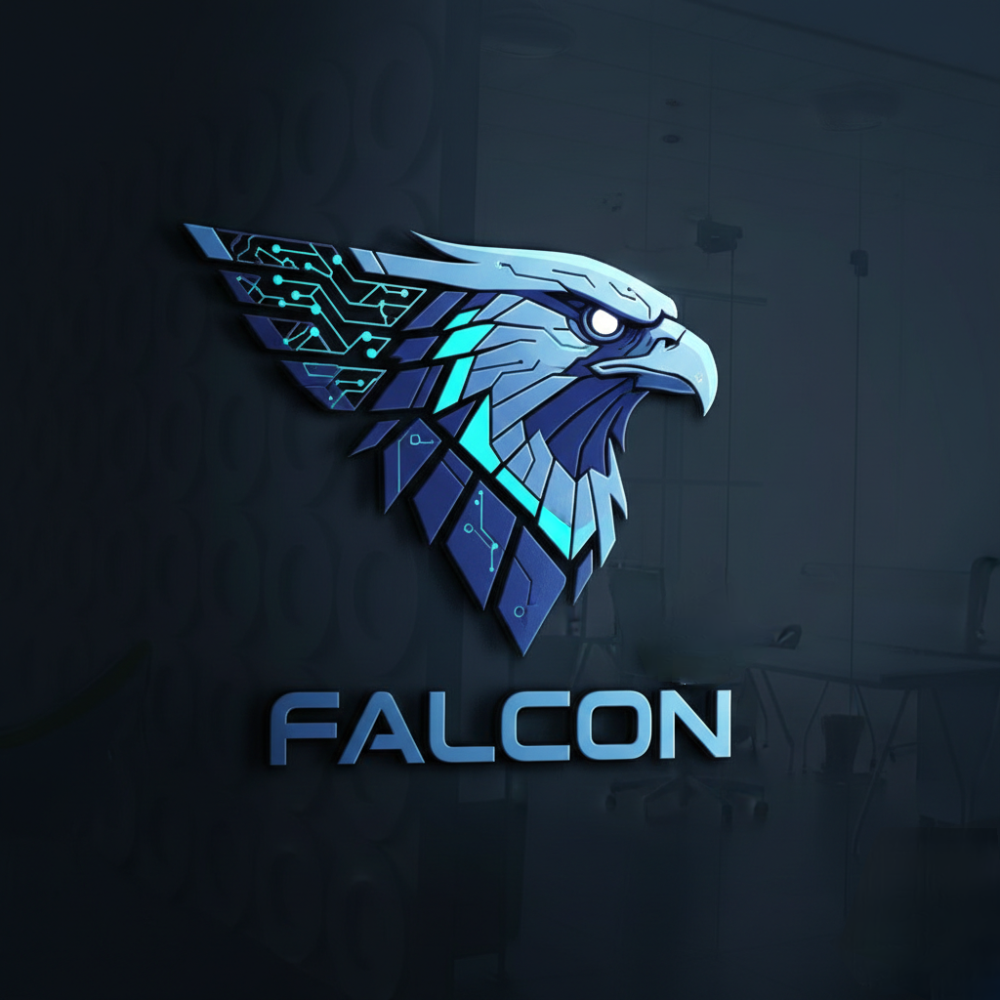

# 🦅 Falcon Programming Language (2026)
> **The Most Secure, AI-Native Language for the Quantum Era.**



[](https://github.com/sayan9168/falcon)
[](https://github.com/sayan9168/falcon)
[](https://github.com/sayan9168/falcon)

**Falcon** is not just a language; it is a fortress for your code. Designed in 2026, Falcon introduces **Shield-Core Memory Architecture**, ensuring your data is encrypted at the RAM level, making it the world's first "Zero-Trust" programming language.

---

## 🛡️ Core Pillars of Falcon

### 1. 🔐 Shield-Core™ Sandbox & Protection
Unlike traditional languages, Falcon's Shield-Core automatically encrypts sensitive variables. In v4.0, we have implemented a **Secure Sandbox** that restricts file operations (`file.read/write`) to authorized directories only, keeping your system safe from malicious scripts.

### 2. 🤖 Native AI Integration (`ai.ask`)
Falcon is built for the AI era. You can now call AI intelligence directly within your code logic without complex libraries.
```falcon
secure let query = "Optimize this security protocol"
secure let response = ai.ask(query)
print(response)
3. 🧬 Integrated Standard Library (FSL)
The Falcon Standard Library now supports:
falcon.math: Native arithmetic operations (+, -, *, /) for complex calculations.
falcon.io: High-speed, sandboxed file handling.
network.send: Direct transmission bridge for remote data synchronization.
📝 Modern Syntax Example
// Advanced Math and AI Logic
secure let base_power = 100
secure let boost = 50
secure let total = base_power + boost

repeat 3
    print("Shield Pulse Scanning...")
endrepeat

if total > 120
    print("Maximum Capacity Reached!")
    secure let advice = ai.ask("How to balance 150 units?")
    print(advice)
endif

file.write("status.log", "Falcon Core Stable")
🚀 Installation & Usage
Run your Falcon scripts using the following command:
python falcon_engine.py examples/test.fcn
🗺️ Roadmap to v5.0
[x] Lexer/Parser Architecture (Completed)
[x] Math & File I/O Engine (Completed)
[x] AI & Security Sandbox (Active)
[ ] Bytecode Compiler (In development for v5.0)
[ ] Cross-platform Native Binaries
© 2026 Falcon Core Team. Built for the next generation of secure computing. 🦅🔥
## 🛡️ Shield-Core™ Security Implementation

Falcon protects your system using a **Whitelisted Sandboxing** mechanism.

- **File System Lock:** The engine checks every `file.write` or `file.read` call using `is_path_allowed()`. It restricts access only to the project's base directory, preventing scripts from accessing sensitive system files like `/etc/passwd` or private documents.
- **Variable Encryption:** Variables declared with `secure let` are handled within a protected memory space in the engine's state.
- **Zero-Trust Network:** All `network.send` calls are routed through a secure bridge, ensuring no unauthorized data leaks.
## 📦 Professional Tooling
- **Standard Library:** Use `import "fsl"` to access built-in constants.
- **Easy Install:** Run `pip install .` to install Falcon as a system tool.
- **Performance:** Verified with `benchmarks.fcn`.
